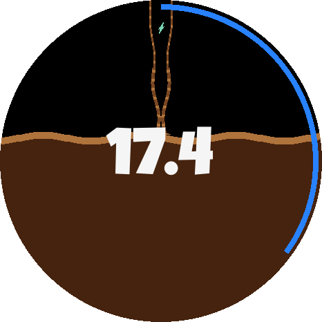
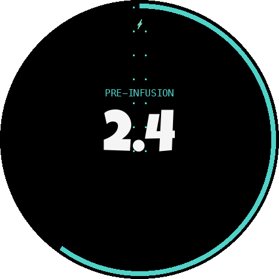
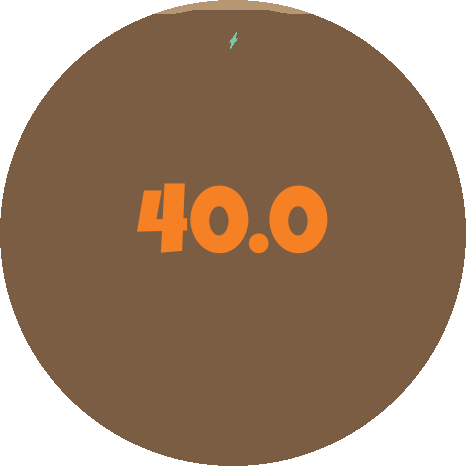
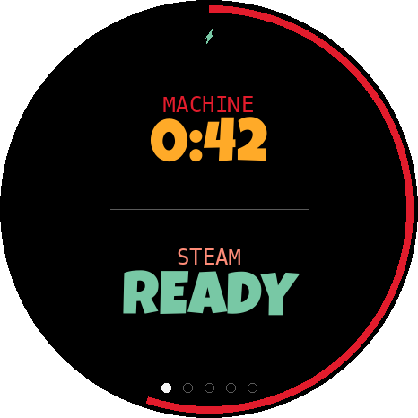
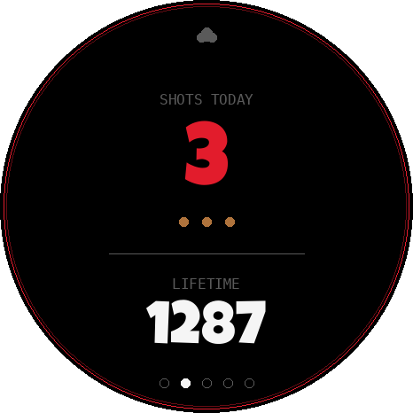
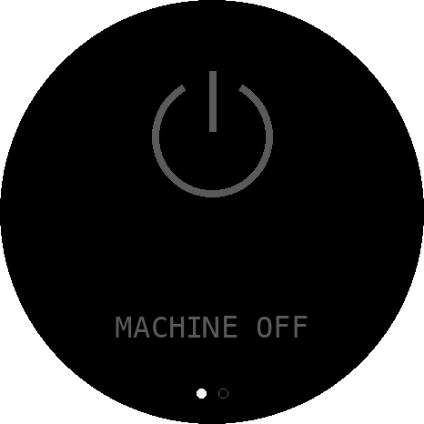
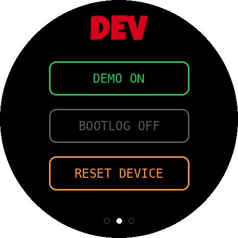
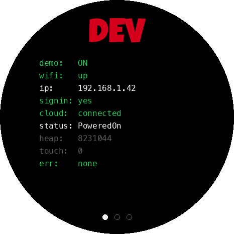
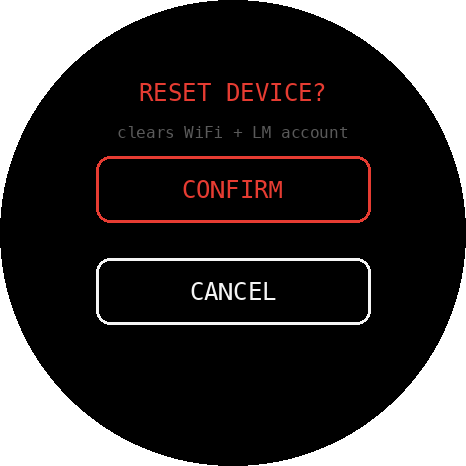
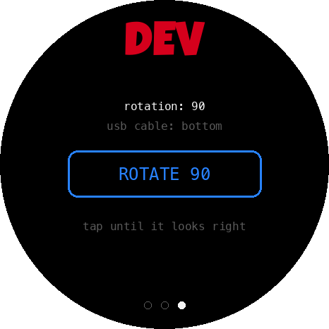

# La Marzocco Micra — External Brew Display

A standalone **LilyGO T-Display-S3-AMOLED 1.43"** (ESP32-S3, round 466×466 AMOLED) that shows the
realtime shot timer and machine status of a **La Marzocco Linea Micra** (newest Gateway v5+
firmware) — a fancy, glanceable companion to the official La Marzocco Home app.

## Screenshots

Stylized renders of the on-device screens (round 466×466 panel). Regenerate with
[`tools/render_mockups.py`](tools/render_mockups.py).

| Brewing | Pre-infusion | Over-extraction |
|:---:|:---:|:---:|
|  |  |  |
| **Readiness** | **Shot stats** | **Machine off** |
|  |  |  |
| **Dev · actions** | **Dev · diagnostics** | **Dev · reset confirm** |
|  |  |  |
| **Dev · display** | | |
|  | | |

## Features

- **Realtime shot timer** — when you pull a shot, coffee pours in from the top and fills the cup
  bottom→top (crema band + wavy surface), with the elapsed time counting up in the center (Luckiest
  Guy font). Detected in ~1–2 s via the cloud **websocket**.
- **Pre-infusion phase** — reads the pre-brew/pre-infusion time you configured in the app and shows
  a realtime pre-infusion animation (teal ring + drips) for those first seconds, then hands off to
  the fill. Auto-adapts to whatever the machine reports.
- **Over-extraction warning** — past ~30 s the coffee washes out to a pale "watery" tone and the
  timer shifts white → amber → red.
- **Heat-up rings** — two arcs deplete from full as the boilers warm: **machine** (pink/purple) and
  **steam** (blue), with M:SS countdowns; full → gone when ready. The steam ring also appears on the
  shot screen if you pull before steam is ready.
- **Shot stats** — shots today (hero + crema dots) and lifetime total (from the cloud counters).
- **Backflush page** — start the machine's backflush cleaning cycle from the display (confirm
  modal, live CLEANING spinner from the cloud status, DONE screen, "cleaned N days ago").
- **Machine-off screen** — machine illustration + "MACHINE OFF" when off/unreachable.
- **Touch UI** — swipe carousel with gallery page dots and a connection icon (lightning =
  websocket, cloud = REST); a hidden **develop mode** (press-and-hold) with live diagnostics
  (wifi/ip/signin/cloud/status/heap/touch), an actions page (demo / boot log / factory reset),
  and a display page (screen rotation, persisted — touch remaps automatically).
- **Boot-log console** — a persisted dev toggle that mirrors the startup log (WiFi, sign-in,
  websocket) to the display, for debugging connection issues without a computer.
- **Screen standby** — after 15 min with no touch and no machine events the AMOLED goes fully
  dark (pixels off, for panel longevity); any touch or machine activity (power on, brew start,
  boiler ready, backflush) wakes it instantly.
- **WiFi captive portal** (WiFiManager) — set WiFi from your phone, no re-flash.
- **Demo mode** — a self-contained animated preview of every screen.

See **[docs/PRODUCT.md](docs/PRODUCT.md)** for the full screen-by-screen guide and gestures.

## How it gets the data

The newest firmware has **no local API**; machine state lives only in La Marzocco's cloud
(`lion.lamarzocco.io`). The device authenticates as a registered client (on-device **ECDSA-secp256r1
request signing** ported from `pylamarzocco`, via mbedTLS), with all TLS verified against **pinned
Amazon/Starfield root CAs** (`ca_certs.h`), and then:

- **Realtime:** subscribes to the dashboard over a **STOMP-over-wss websocket** for instant brew
  start/stop.
- **Coexistence:** the cloud allows only one realtime connection per machine, so when you open the
  official app it takes over; the display detects the drop, **falls back to REST polling** for a
  short backoff, then reconnects when the app is closed. The app always wins when you need it.

Brew state comes from the `CMMachineStatus` widget (`status` → `Brewing`, `brewingStartTime`); the
timer counts up locally from that start, re-synced on each message. Pre-infusion comes from
`CMPreBrewing`. Validated against a real machine — see `docs/plan.md`.

## Hardware

LilyGO **T-Display-S3-AMOLED 1.43"** (product code H741): ESP32-S3-R8, 16 MB flash, 8 MB PSRAM,
**466×466 round AMOLED**. This unit uses the **CO5300** panel driver (QSPI) and an **FT3168**
capacitive touch controller. Pin map: `firmware/include/pin_config.h`. (The sister panel
`DO0143FAT01` uses SH8601 — switch via `-DUSE_CO5300=0`.)

## Quick start

1. **Pre-flight (validate cloud + make the installation key):**
   ```bash
   cd tools/preflight
   python3 -m venv .venv && source .venv/bin/activate   # or: uv venv
   pip install -r requirements.txt
   cp .env.example .env        # fill in LM login, WiFi, serial
   python preflight.py         # signs in, writes installation_key.json
   ```
2. **Generate the firmware secrets header from `.env` + the installation key:**
   ```bash
   python3 tools/gen_secrets.py     # writes firmware/include/secrets.h (git-ignored)
   ```
3. **Build & flash** ([PlatformIO](https://platformio.org/) core ≥ 6.1.19):
   ```bash
   cd firmware
   pio run -t upload
   ```
   The project pins the **pioarduino** platform fork (Arduino core 3.x); the official `espressif32`
   platform is stale. If upload can't find the board: hold **BOOT**, tap **RST**, release **BOOT**.
   On Python 3.14 systems, run PlatformIO from a 3.12 environment (its bootstrap needs ≤ 3.13).

Without `secrets.h` (or with placeholder WiFi) the device runs in **demo mode** so you can see every
screen with no machine.

## Repository layout

```
firmware/                 PlatformIO project (ESP32-S3)
  include/                pin_config.h, config.h, secrets.h.example
  src/
    main.cpp              app loop: state machine, gestures, gallery
    display.*             rendering (logo, timer, pre-infusion, rings, stats, backflush, dev, dots)
    lm_client.*           data source: demo sim + live cloud client (websocket + REST hybrid)
    lm_auth.*             request signing (ECDSA + custom proof, mbedTLS)
    ca_certs.h            pinned root CAs for lamarzocco.io TLS
    bootlog.*             on-screen boot-log console (persisted dev toggle)
    touch.*               FT3168 capacitive touch reader
    log.h                 DEBUG_LOG-gated logging macros (also feed the boot-log console)
    brew_state.h          shared machine-state struct
    fonts/, logo_lm.h, machine_off.h   generated assets (git-ignored)
tools/preflight/          Python: validate cloud access + generate the installation key
tools/gen_secrets.py      build secrets.h from .env + installation_key.json
docs/                     PRODUCT.md (this device), plan.md (implementation plan)
```

## Configuration

- **Tunables** (`firmware/include/config.h`): poll + stats intervals, brightness, coffee-fill
  seconds, over-extraction window, post-shot hold, boot-log hold, timezone, `LIVE_TIMER_OFFSET_S`,
  `DEBUG_LOG` (verbose serial), `DEMO_MODE`, `STARTUP_TEST`.
- **Secrets** are kept in `tools/preflight/.env` (single source of truth) and compiled into
  `firmware/include/secrets.h` by `tools/gen_secrets.py`. Both are git-ignored; **no credentials or
  keys are ever committed** (see `.gitignore`).

## License

**MIT** (see `LICENSE`). All dependencies are permissive — `pylamarzocco` (MIT, the cloud protocol
reference), Arduino_GFX / ArduinoJson / WiFiManager (MIT), mbedTLS (Apache-2.0), and the Luckiest Guy
font (Apache-2.0). MIT keeps this project maximally reusable and is compatible with all of them.

## Credits

Cloud protocol referenced from [pylamarzocco](https://github.com/zweckj/pylamarzocco) (MIT).
Graphics via [Arduino_GFX](https://github.com/moononournation/Arduino_GFX). WiFi onboarding via
[WiFiManager](https://github.com/tzapu/WiFiManager). "Luckiest Guy" font by Astigmatic (Apache-2.0).
Not affiliated with or endorsed by La Marzocco.
